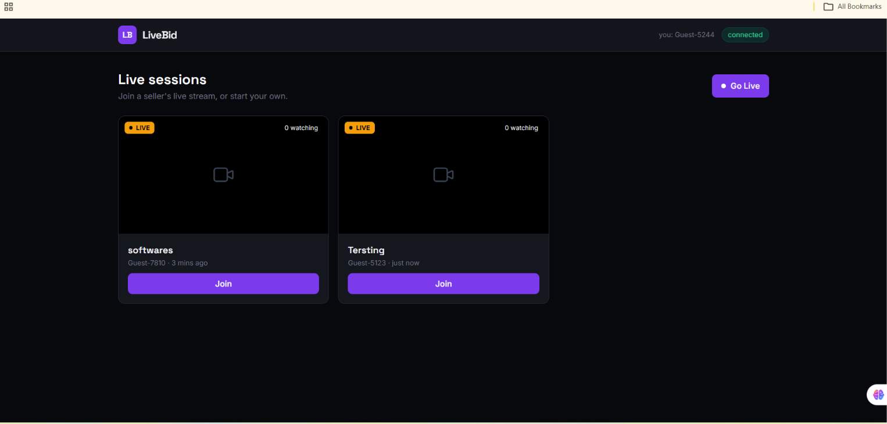
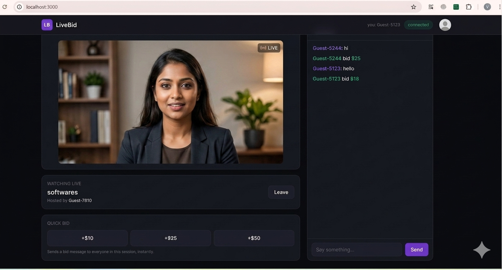
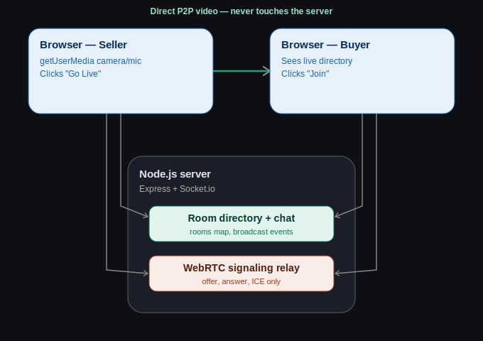

<div align="center">

# 🎥 WebRTC_Live_Streaming

**Real-time live-commerce prototype** — multi-room live streaming, instant chat, and text-based bidding, built on Node.js, Express, Socket.io, and native WebRTC.

[](https://nodejs.org)
[](https://expressjs.com)
[](https://socket.io)
[](https://webrtc.org)
[](https://tailwindcss.com)
[](#license)

[Features](#features) · [Architecture](#architecture) · [Getting started](#getting-started) · [Deployment](#deployment)

</div>

---

## 📸 Screenshots

> Replace these placeholders with real screenshots of your running app before sharing this repo — see [Adding your own screenshots](#adding-your-own-screenshots) below.

<div align="center">
<table>
<tr>
<td align="center" width="50%">

<br/><sub>Live session directory — see who's live, join with one click</sub>
</td>
<td align="center" width="50%">

<br/><sub>Live room — video, real-time chat, and quick-bid buttons</sub>
</td>
</tr>
</table>
</div>

### Adding your own screenshots

1. Run the app locally (`npm install && npm start`) and open `http://localhost:3000`.
2. Go live in one window, join from another, send a few chat messages and bids.
3. Take screenshots of both screens.
4. Save them into a `images/` folder in this repo as `screenshot-directory.png` and `screenshot-room.png`.
5. Commit and push — GitHub will render them automatically in this README.

---

## ✨ Features

- 🔴 **Multi-room live streaming** — any user can start their own live session; the directory updates for everyone in real time as people go live or end their stream.
- 🤝 **Peer-to-peer video via native WebRTC** — the server only relays signaling (SDP offers/answers, ICE candidates). Actual video/audio never touches the server, just like production live-streaming platforms.
- 💬 **Real-time chat, scoped per room** — messages broadcast instantly to everyone watching that specific session, and never leak into other concurrent rooms.
- 💰 **Text-based live bidding** — quick-bid buttons (`+$10`, `+$25`, `+$50`) post tagged bid messages into the same live feed everyone can see.
- 🧭 **Clear join flow** — land on a directory of live sessions, click **Join**, watch, chat. Click **Go Live** to host your own.
- 🌓 **Polished dark-mode UI** — built with Tailwind CSS, custom type system (Space Grotesk + Inter + JetBrains Mono), and subtle motion for live state changes.
- ⚡ **Zero build step** — plain ES modules, no bundler, no TypeScript compile — clone and run.

---

## 🏗 Architecture

<div align="center">

</div>

**The most important detail:** video is **peer-to-peer**. Once a viewer joins a room, the server's job is done — it only relayed a handful of small signaling messages to help the two browsers find each other. From that point on, the actual video stream flows directly between the seller's browser and the viewer's browser. This is exactly how WebRTC is used in production by Google Meet, Discord, and similar real-time video products — it's also why this architecture can scale to many concurrent viewers without the server's bandwidth becoming a bottleneck for video itself.

Socket.io's job is everything **other** than the raw video bytes:
- Keeping the live-session directory in sync across every connected browser
- Relaying chat and bid messages to everyone currently in a given room
- Forwarding the WebRTC handshake (offer → answer → ICE candidates) between a host and each new viewer

State is currently held in memory on the server (a `Map` of active rooms). This keeps the demo dependency-free and instant to run — see [Roadmap](#roadmap) for notes on swapping this for persistent storage.

---

## 🚀 Getting started

### Prerequisites
- [Node.js](https://nodejs.org) 18 or later
- A modern browser (Chrome, Edge, or Firefox recommended for WebRTC + camera support)

### Run locally

```bash
git clone https://github.com/NimraNimmi/WebRTC_Live_Streaming
cd WebRTC_Live_Streaming
npm install
npm start
```

Open **http://localhost:3000**

### Test the full multi-user flow

1. Open the URL above in **one browser window** → click **Go Live** → allow camera/mic access.
2. Open the same URL in a **second window** (a different browser, or an incognito/private window — two regular tabs in the same browser will compete for the same webcam) → you'll see the first session in the live directory → click **Join**.
3. Send a chat message or click a quick-bid button from either window and watch it appear instantly in both.
4. Open a **third window** to confirm the directory and chat scale correctly to multiple concurrent viewers.

---

## 📁 Project structure

```
livebid/
├── server.js          # Express + Socket.io server: rooms, chat, WebRTC signaling relay
├── package.json
├── public/
│   └── index.html     # Single-page app: directory screen + live room screen
├── images/
│   └── architecture.svg
│   └── screenshot-directory.png
│   └── screenshot-room.png
├── Dockerfile          # For container-based deployment (e.g. Fly.io)
├── fly.toml             # Fly.io app configuration
└── DEPLOY.md            # Step-by-step Fly.io deployment guide
```

---

## ☁️ Deployment

This app uses **persistent WebSocket connections**, so it needs a host that runs a long-lived Node process — traditional serverless platforms (like Vercel's default deployment model) aren't a fit, since each request there spins up a short-lived, isolated function rather than keeping a socket connection open.

Hosts that work well for this project: **Fly.io**, **Render**, **Railway**, or any VM/container host.

Full step-by-step instructions for Fly.io are in **[DEPLOY.md](DEPLOY.md)**.

---

## 🛠 Tech stack

| Layer | Technology |
|---|---|
| Server | Node.js, Express |
| Real-time transport | Socket.io (WebSocket with polling fallback) |
| Video/audio | Native browser WebRTC (`RTCPeerConnection`, `getUserMedia`) |
| Frontend | Vanilla JavaScript (ES modules), no framework |
| Styling | Tailwind CSS (CDN runtime), Google Fonts (Space Grotesk, Inter, JetBrains Mono) |
| Deployment | Docker, Fly.io |

---

## 🗺 Roadmap

- [ ] Persist room history and chat logs (e.g. MongoDB) so they survive a server restart
- [ ] Move from a full-mesh WebRTC model (one connection per viewer) to an SFU (e.g. mediasoup, LiveKit) for sessions with many concurrent viewers
- [ ] Real currency wallet / ledger system alongside the current text-based bidding
- [ ] Authenticated user accounts (currently uses anonymous per-tab guest identities)

---

## 📄 License

MIT — free to use for learning, prototyping, or as a starting point for your own project.

---

<div align="center">
<sub>Built as a technical demo for a full-stack live-commerce marketplace interview.</sub>
</div>
